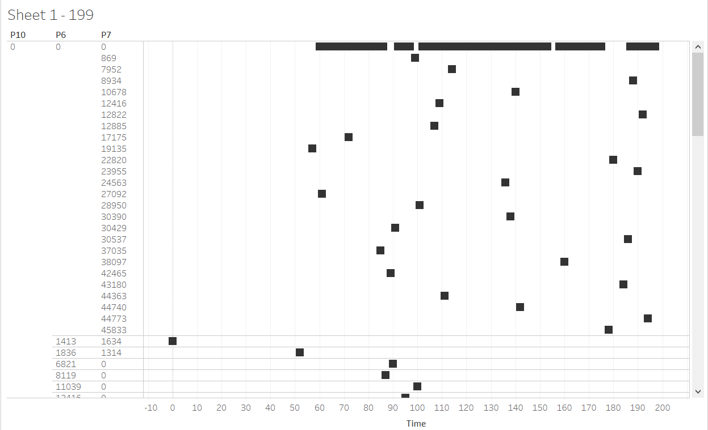

# Particle_Swarm_Optimization_Cloud_Computing
### Problem Statement
Cloud computing mainly deals with offering Infrastructure as a service,Platforms as a service and Internet as a service inside
its own virtualized Infrastructure. Allocation of resources to servers in a cloud environment across different data centres which
gives a optimized solution by increasing the company profits and decreasing the bandwidth consumption is difficult. This project 
aims at finding a optimized solution to select data centers of a company/firm in the most efficient way

### Screenshot of Simulation using motion charts for the 7th particle

### Input Constants
  - int SWARM_SIZE = 20;
	- int MAX_ITERATION = 50;
	- int PROBLEM_DIMENSION = 2;
	- double C1 = 2.0;
	- double C2 = 2.0;
	- int requirement = 2000;

### Output Values
  - SERVER id:0     SERVER offering:500       Server Distance from hub:553
  - SERVER id:1     SERVER offering:600       Server Distance from hub:769
  - SERVER id:2     SERVER offering:700       Server Distance from hub:1152
  - SERVER id:3     SERVER offering:800       Server Distance from hub:651
  - SERVER id:4     SERVER offering:900       Server Distance from hub:1762
  - SERVER id:5     SERVER offering:1000       Server Distance from hub:1292
  - SERVER id:6     SERVER offering:1100       Server Distance from hub:2504
  - SERVER id:7     SERVER offering:1200       Server Distance from hub:3120
  - SERVER id:8     SERVER offering:1300       Server Distance from hub:483
  - SERVER id:9     SERVER offering:1400       Server Distance from hub:1874
  - SERVER id:10     SERVER offering:1500       Server Distance from hub:1234
  - SERVER id:11     SERVER offering:1600       Server Distance from hub:1828
  - SERVER id:12     SERVER offering:1700       Server Distance from hub:1023
  - SERVER id:13     SERVER offering:1800       Server Distance from hub:2085
  - SERVER id:14     SERVER offering:1900       Server Distance from hub:1200
  - SERVER id:15     SERVER offering:2000       Server Distance from hub:2364
  - SERVER id:16     SERVER offering:2100       Server Distance from hub:1427
  - SERVER id:17     SERVER offering:2200       Server Distance from hub:1484
  - SERVER id:18     SERVER offering:2300       Server Distance from hub:2396
  - SERVER id:19     SERVER offering:2400       Server Distance from hub:538

### Best Server Chosen:15 after 50 iterations 

